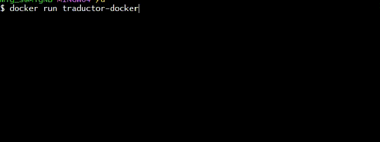

# Helsinki-NLP
## _Ejemplo de implementación de Helsinki-NLP_

Este ejemplo utiliza 2 modelos para la traducción de lenguaje, 
Inglres -> Español
Español -> Inglres

## Partes

- Traslada4.py: Ejemplo Español -> Inglres
- Traslada5.py: Ejemplo Inglres -> Español
- Dockerfile: Archivo Docker para ejecutar en un contenedor

## Puesta en ejecución

Requiere docker instalado.

Se genera la imagen con los componentes
```sh
docker build -t traductor-docker .
```

Para ejecutar
```sh
docker run traductor-docker
```



## Link

Información relacionada:

- [Helsinki-NLP] - https://huggingface.co/Helsinki-NLP
- [opus-mt-es-en] - https://huggingface.co/Helsinki-NLP/opus-mt-es-en
- [Helsinki-NLP-opus-mt-es-en] - https://metatext.io/models/Helsinki-NLP-opus-mt-es-en